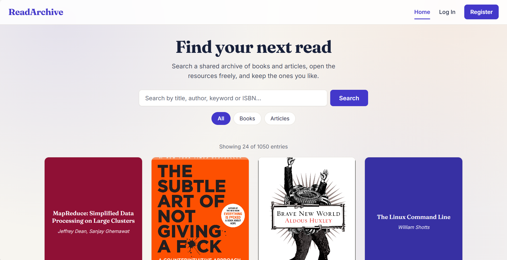

# 📚 ReadArchive — Community Reading Archive

> A community-driven archive for books and articles where users can search by title, author, keyword or ISBN, view descriptions, and open resource links. Registered users can contribute entries, save favorites, and organize them into collections.

[](https://nodeexpressmongoreact-readarchive.onrender.com)
[](https://github.com/zhitengg7898-design/nodeExpressMongoReact_ReadArchive)
[](ADD_YOUR_NEW_VIDEO_LINK_HERE)

---

## 👤 Authors

| Field         | Student 1                                     | Student 2                                                     |
| ------------- | --------------------------------------------- | ------------------------------------------------------------- |
| **Name**      | Smitkumar Jayendrakumar Velani                | Zhiteng Guo                                                   |
| **Email**     | velanismitkumar@gmail.com                     | guo.zhit@northeastern.edu                                     |
| **GitHub**    | [Smit-Velani](https://github.com/Smit-Velani) | [zhitengg7898-design](https://github.com/zhitengg7898-design) |
| **Published** | August 2026                                   | August 2026                                                   |

---

## 🎓 Class

**CS5610 — Web Development**
Khoury College of Computer Sciences, Northeastern University
🔗 [Course Page](https://johnguerra.co/classes/webDevelopment_online_summer_2026/)

---

## 🎯 Project Objective

ReadArchive is a full-stack reading archive built with Node.js, Express, MongoDB (native driver), and React with Hooks (client-side rendered). Anyone can search for books and articles and open their resource links without an account. Registered users can contribute new entries, add resource links to existing entries, save favorites, and organize entries into named collections.

**The problem we solve:** information about books and research papers is scattered across many websites. ReadArchive centralizes it — one place to find, contribute, and organize reading resources, built by the community.

---

## 📸 Screenshot



> Live at: **https://nodeexpressmongoreact-readarchive.onrender.com**

> Demo video: **https://youtu.be/yn33R8_dugs**

> Note: hosted on Render's free tier — the first request after inactivity may take up to 50 seconds to wake.

---

## ✨ Features

**Book & Article Catalog (Smitkumar Velani)**

- Search books and articles by title, author, keyword or ISBN, with case-insensitive partial matching
- Filter by type (books / articles), with a result count and paginated "Load More"
- View entry details and open resource links (free PDFs, purchase pages) without signing in
- Submit new entries through a guided form with a live cover image preview
- Delete entries you submitted, with a confirmation dialog
- Text-based fallback covers for entries without a usable image

**Favorites & Collections (Zhiteng Guo)**

- Save entries to a personal favorites list
- Create, rename, and delete named collections
- Add and remove entries from collections, each with a confirmation step
- Session-based authentication with Passport.js

**Technical**

- 2 MongoDB collections: `books` and `users`
- RESTful API with full CRUD on both collections
- React with Hooks, client-side rendered via Vite
- ES6 modules throughout — no CommonJS require
- CSS organized in per-component module files, built on shared design tokens
- PropTypes declared for every component that receives props
- No Mongoose, no CORS, no template engines

---

## 🎨 Design & Accessibility

**Typography** — [Fraunces](https://fonts.google.com/specimen/Fraunces), a serif face, is used for all headings to suit a reading archive, paired with [Inter](https://fonts.google.com/specimen/Inter) for body text and interface elements. Both are loaded from Google Fonts, so no default system font is used.

**Color palette** — a warm paper background (`#f7f5f0`) with soft radial washes, an indigo brand color (`#4338ca`), and terracotta accents for articles. The palette is defined once as CSS custom properties in `index.css` and referenced everywhere else, so the whole application stays consistent.

**Approve and cancel colors** are applied the same way on every page:

| Intent            | Color            | Used for                                |
| ----------------- | ---------------- | --------------------------------------- |
| Approve / confirm | Indigo `#4338ca` | Search, Create, Publish, Save, Register |
| Cancel / neutral  | Grey `#4f5a6b`   | Cancel buttons, Log Out                 |
| Destructive       | Red `#c81e1e`    | Delete and Remove actions               |

**Hierarchy** — the most important element on each page sits at the top left or centered above the fold: the brand in the navigation bar, the page heading, then the search field, then the results grid.

**Accessibility — 100 / 100 on Lighthouse.** The application includes:

- A skip link to jump past the navigation
- Semantic landmarks: `header`, `main`, `footer`, and `article` for each entry
- Headings in sequential order, with no skipped levels
- Every form field labelled, with hint text for optional fields
- Visible focus rings on every interactive element
- `aria-pressed` and `aria-expanded` on toggles, `aria-live` on status messages
- Results and collections marked up as real lists
- Confirmation dialogs before any destructive action
- Full keyboard operation, with no mouse required
- Reduced-motion support via `prefers-reduced-motion`

**Usability study** — three participants completed six tasks each. Their findings drove the changes in this iteration, including clearer Favorites and Collections wording, a visible result count, labelled resource-link fields, a cover image preview, and confirmations before deletion.

---

## 🛠️ Instructions to Build

### Prerequisites

- [Node.js](https://nodejs.org/) v18 or higher
- [npm](https://www.npmjs.com/)
- [MongoDB](https://www.mongodb.com/) (Atlas or local)

### Installation

```bash
# Clone the repository
git clone https://github.com/zhitengg7898-design/nodeExpressMongoReact_ReadArchive.git

# Navigate into the project
cd nodeExpressMongoReact_ReadArchive

# Install backend dependencies
npm install

# Install frontend dependencies
cd frontend && npm install && cd ..
```

### Environment Setup

```bash
# Copy the example env file
cp .env.example .env

# Edit .env with your values
# PORT=3000
# MONGO_URI=your_mongodb_connection_string
# SESSION_SECRET=your_secret_here
```

### Seed Database

```bash
# Add 1000+ book and article records to the database
npm run seed
```

### Running Locally

```bash
# Terminal 1 — backend (auto-reload with nodemon)
npm run dev

# Terminal 2 — frontend (Vite dev server)
cd frontend && npm run dev
```

Open the URL printed by Vite, usually `http://localhost:5000`.

### Production Build

```bash
cd frontend && npm run build && cd ..
npm start
```

Open your browser at `http://localhost:3000`.

### Linting and Formatting

```bash
# Run ESLint
npx eslint .

# Format with Prettier
npx prettier --write .
```

---

## 🔌 API Endpoints

### Auth — `/api/auth`

| Method | Endpoint    | Description          |
| ------ | ----------- | -------------------- |
| POST   | `/register` | Create a new account |
| POST   | `/login`    | Log in               |
| POST   | `/logout`   | Log out              |

### Books & Articles — `/api/books`

| Method | Endpoint | Description                       |
| ------ | -------- | --------------------------------- |
| GET    | `/`      | Search / list entries (paginated) |
| GET    | `/:id`   | Get single entry details          |
| POST   | `/`      | Submit a new entry _(auth)_       |
| PUT    | `/:id`   | Update an entry _(auth)_          |
| DELETE | `/:id`   | Delete an entry _(auth)_          |

### Users — `/api/users`

| Method | Endpoint              | Description              |
| ------ | --------------------- | ------------------------ |
| GET    | `/me`                 | Get current session user |
| GET    | `/favorites`          | Get favorites            |
| POST   | `/favorites`          | Add to favorites         |
| DELETE | `/favorites/:bookId`  | Remove from favorites    |
| GET    | `/collections`        | Get collections          |
| POST   | `/collections`        | Create a collection      |
| PUT    | `/collections/:colId` | Update a collection      |
| DELETE | `/collections/:colId` | Delete a collection      |

---

## 🗄️ Database

**MongoDB with 2 collections:**

**`books` collection:**

```json
{
  "_id": "ObjectId",
  "title": "Thinking, Fast and Slow",
  "author": "Daniel Kahneman",
  "type": "book",
  "description": "...",
  "isbn": "978-0-374-53355-7",
  "coverImage": "https://...",
  "links": [{ "label": "Buy on Amazon", "url": "https://..." }],
  "submittedBy": "ObjectId",
  "createdAt": "2026-07-17T00:00:00Z"
}
```

**`users` collection:**

```json
{
  "_id": "ObjectId",
  "username": "smit",
  "email": "smit@example.com",
  "password": "<bcrypt hash>",
  "favorites": ["ObjectId", "..."],
  "collections": [
    { "_id": "ObjectId", "name": "ML Reading List", "books": ["ObjectId"] }
  ],
  "createdAt": "2026-07-17T00:00:00Z"
}
```

The database is seeded with 1000+ synthetic records.

---

## 🔒 Security

- MongoDB credentials stored in `.env` (gitignored, never committed)
- `.env.example` provided as a template with no real credentials
- Passwords hashed with bcryptjs before storage
- Session secret stored in an environment variable
- Auth middleware guards all write operations

---

## 🤖 GenAI Tools

| Tool   | Provider  | Usage                                                         |
| ------ | --------- | ------------------------------------------------------------- |
| Claude | Anthropic | Frontend development, design and accessibility, documentation |

**How it was used:**

- **Frontend (React)** — assistance building the React components (Home, BookDetail, BookCard, Navbar, Login, Register, Favorites, Collections, SubmitEntry), the API client, and the auth context, with an explanation of each file
- **Design and accessibility pass** — help defining the design token system, the typography pairing, and the semantic and ARIA markup that took the Lighthouse accessibility score to 100
- **README and design document** — help structuring the documentation and wireframes
- **Debugging and deployment** — troubleshooting the MongoDB Atlas connection and the Render deployment configuration

**What was NOT AI generated:**

- MongoDB connection module and native-driver collection setup
- Express REST API routes (auth, books, users)
- Passport.js session authentication
- Seed script for 1000+ records
- The usability study, its participants, and its findings

---

## 📄 License

This project is licensed under the **MIT License** — see the [LICENSE](LICENSE) file for details.

---

## 📋 Design Document

The full design document including project description, user personas, user stories, and design mockups is available here:

📄 [DESIGN.md](DESIGN.md)

---

## 🎤 Presentation

📊 [View the project slides](https://docs.google.com/presentation/d/1ZNfEQ9SBFo-LG8-YNbBElUfMsbKZkHrk/edit?usp=sharing)

---
## 📊 Usability Study

A usability study was conducted with three participants per team member, six tasks each. The findings drove this iteration's changes, which are documented in [DESIGN.md](DESIGN.md). The full report, including participant demographics and session recordings, was submitted separately on Canvas and is not published here for participant privacy.

---

<p align="center">
  Built by <strong>Smitkumar Jayendrakumar Velani</strong> and <strong>Zhiteng Guo</strong> &middot; CS5610 Web Development &middot; Northeastern University &middot; August 2026
</p>
